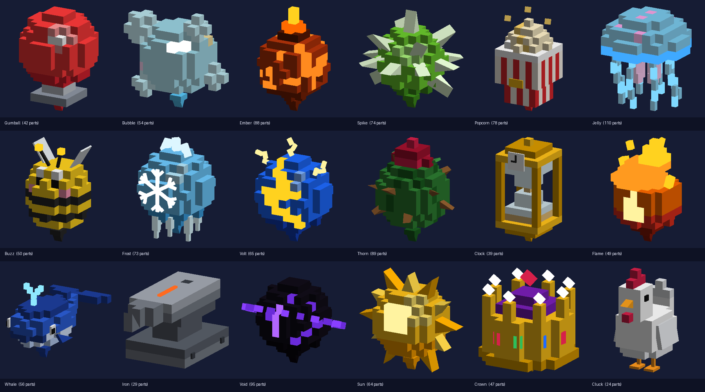

# Balloons

All 18 balloons from section 3.2 of the game prompt, built as classic stud models (section 14).



*Previews come from the build script's own renderer, not Studio. Studs, Glass and Neon look better in-game.*

## How they're made

`tools/balloons/build_balloons.py` designs each balloon as a 1-stud voxel grid plus a few hand-placed detail parts (wedge spikes, tentacles, wings, rays). Same-colour voxels are greedily merged into as few Parts as possible: every balloon is 24–110 parts, inside the prompt's 40–120 budget or under it. The script writes `src/shared/Balloons/BalloonModels.lua` (generated data, don't hand-edit) and the preview PNGs in `docs/balloons/`.

```
python3 tools/balloons/build_balloons.py            # regenerate the Luau data
python3 tools/balloons/build_balloons.py --preview  # also re-render previews (needs numpy + pillow)
```

In game, `BalloonBuilder.Build(kind, { Anchored, CFrame, Scale })` makes a Model whose PrimaryPart is an invisible `Root` at the balloon centre. Every part is welded to Root, so `Model:PivotTo` and `Model:ScaleTo` work (grow the balloon with ScaleTo, as the prompt says). `Root.StringAttachment` sits at the knot, ready for the string or a `RopeConstraint`. Plastic parts get Studs on top and Inlets underneath; Neon, Glass and SmoothPlastic are used only for glows, bubbles, paper and eyes.

| Balloon | Silhouette |
|---|---|
| Gumball | Glossy red stepped sphere on a little silver gumball-machine stand |
| Bubble | Hollow glass bubble with four small bubbles and rainbow sheen |
| Ember | Dark ember sphere with glowing lava cracks and a flame tuft (PointLight) |
| Spike | Green sphere bristling with 15 two-wedge spikes |
| Popcorn | Red-and-white striped bucket, buttery kernel heap, kernels tumbling off |
| Jelly | Glass jellyfish dome with a neon rim, glowing core and 8 dangling tentacles |
| Buzz | Striped bee with eyes, cheeks, glass wings, antennae and a stinger |
| Frost | Ice sphere with a Neon snowflake emblem, icicles and crystals on top |
| Volt | Electric-blue sphere with a Neon lightning bolt and sparks |
| Thorn | Dark vine-wrapped sphere with thorns and a red rose on top |
| Clock | Gold hourglass (two stepped glass pyramids) with sand and a clock face |
| Flame | Teardrop flame, red → orange → Neon yellow, with a hot core |
| Whale | Long blue block whale: belly grooves, eyes, fins, flukes, Neon spout |
| Iron | Chunky grey anvil with a horn, bolts and a glowing hammer mark |
| Void | Black sphere with a Neon eye slit and a tilted ring of orbiting cubes |
| Sun | Gold sphere with 11 flat rays and a glowing core |
| Crown | Gold crown with a velvet cap, pearl points and gems |
| Cluck | Block chicken: comb, beak, wattle, wings, tail and dangling legs |

## Height: decision A

`height target = 40 × size^0.6 × Lift` (`BalloonConfig.HeightFor`). With Lift = 1 the original formula never passes about 4,900 studs, so Phase 3 and 4 zones were unreachable. Lift is tuned so each balloon at max size (level 1) reaches the zone where the next tier is sold:

| Balloon | Max size | Lift | Max height |
|---|---|---|---|
| Gumball / Bubble / Ember | 100 / 90 / 120 | 1 | ~630 / 600 / 710 (Cloud Shelf) |
| Spike / Popcorn | 180 / 200 | 2 | ~1,800 / 1,920 (Kite Fields) |
| Jelly / Buzz | 220 / 350 | 5 | ~5,100 / 6,700 (Windways) |
| Frost | 400 | 7 | ~10,200 (Thunderhead) |
| Volt / Thorn | 700 / 750 | 9 | ~18,300 / 19,100 (Hail Belt) |
| Clock / Flame | 800 / 1,200 | 14 / 13 | ~30,900 / 36,600 (Stratosphere) |
| Whale / Iron | 1,600 / 1,300 | 19 / 17 | ~63,600 / 50,200 (Orbit) |
| Void / Sun / Crown / Cluck | 2,200–3,000 | 20 | ~76,000–98,000 |

Levels add +2% Max Size each, so upgraded balloons climb further into their zone.

## Demo gallery

In demo mode the client builds an arc of stud pedestals near the SpawnLocation with every balloon floating and spinning over a nameplate (name, tier colour, Lift). Each pedestal has a **Try it** prompt that swaps the balloon over your head. Its HP becomes that balloon's Toughness, so you can watch hazards attack a Thorn (12 HP) or a Gumball (3 HP).

## Open questions

- **Riders:** the prompt's "+1 rider per 2 Lift" no longer fits Lift values up to 20. `BalloonConfig` sets riders per balloon instead (Common 1, Rare 2, Epic 3, Whale 6, Thorn 0, Mythic 4).
- **Premium bundles:** decided 2026-09-30, option **b**: the six Robux bundles (Royal Treasury, Galaxy Vault, Solar Ascension, Inferno Forge, Frozen Diamond, Thunder Emperor; 18 jewelled balloons in gift chests) are truly stronger balloons. This deliberately overrides section 13's "no power for Robux" rule. Their stats and models are still to be built.
