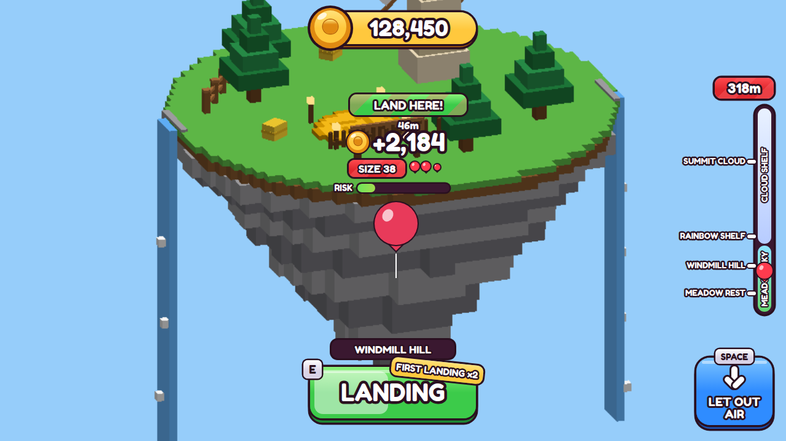
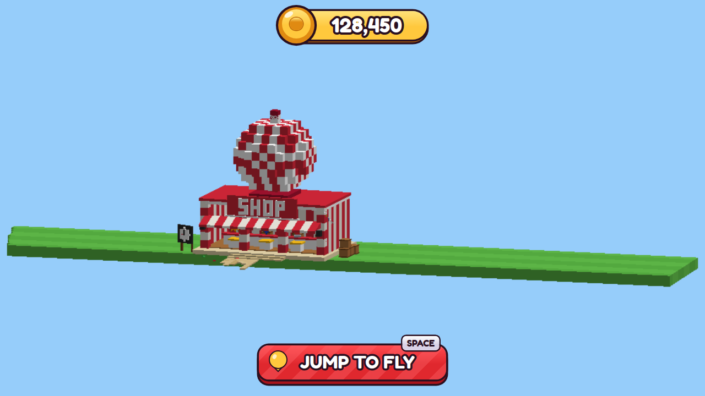
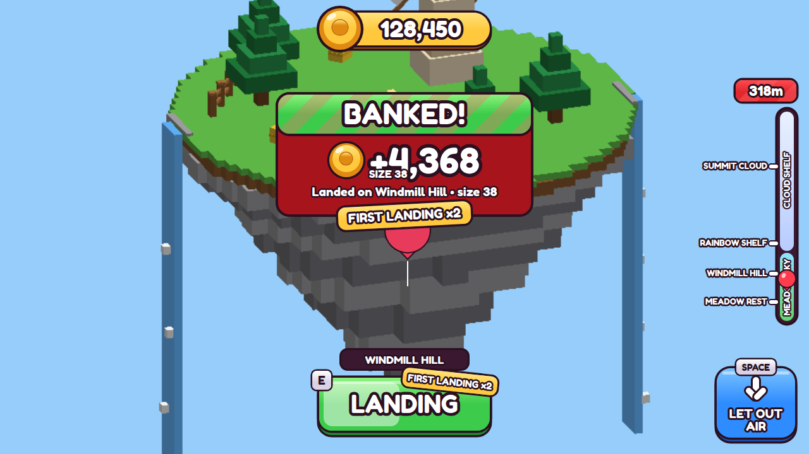

# Flying, saving and the HUD (milestone M1)

You hold a balloon, jump, and it lifts you. It grows every second, you earn unbanked coins, and you land on an island to bank them before something pops you.

## Install (drag-in)

1. Delete the old **HazardPack** from Workspace. **GamePack** replaces it.
2. Drag `build/GamePack.rbxmx` into Studio, plus `build/StartMap.rbxmx` and `build/SkyIslands.rbxmx` if they aren't already in the place.
3. Press Play.

To save data in Studio, turn on *Game Settings → Security → Enable Studio Access to API Services*. Without it ProfileStore runs in mock mode: everything works, but nothing is written.

With Rojo, `GameBootstrap.server.lua` and `GameBootstrap.client.lua` start the same code.

## Controls

| | Keyboard | Touch / pad |
|---|---|---|
| Take off | Jump (Space) while holding a balloon on the ground | Jump button / A |
| Drift | WASD | Thumbstick |
| Let out air (drop fast, lose 5% size/s) | Hold **Space** | Hold **LET OUT AIR** / A |
| Land (near an island) | Hold **E** | Hold **LAND** / X |

## How it feels (drifty steering)

- Input *accelerates* you (30 studs/s²) and drag bleeds speed off slowly (0.7/s), so you keep sliding after you let go. Top speed is 22 studs/s.
- A lazy wind (up to 5 studs/s) changes direction every 3 to 7 seconds, so hovering over an island takes a little steering.
- You rise automatically to the server's height target (`40 × size^0.6 × Lift` above where you took off) at 14 + 3·√Lift studs/s, and sink at 30 studs/s when it drops.
- **Let out air** (hold Space) drops you at 30 studs/s right away and costs 5% of the balloon's size per second. Let go and you float back up at 6 studs/s to your now-smaller balloon's height. That makes it a real dodge, and a way down to an island below you. It works the same on high-Lift balloons that are far over the zone ceiling, and it stops 6 studs above the grass.
- You never get pushed into an island: if you rise under one or sink onto one, you stop at its surface and can drift away sideways.
- Your body leans into the drift and turns to face where you're going. The balloon trails behind on its string.
- The camera pulls back as the balloon grows. The balloon's visual size caps at 1.25× so giant balloons don't break physics.
- After a pop there's no parachute: you fall straight down, capped at 160 studs/s so you can't tunnel through the ground.

All numbers are in `src/shared/Config/FlightConfig.lua`.

## Landing

- Land on any sky island: be within its radius + 6 studs horizontally, from 10 below to 22 above its top, then hold E for **2.0 s**. Growth pauses while you land, but hazards can still hit you.
- **The start map counts too.** Let out enough air to get under ~60 studs and you can land anywhere on the grass. Without this, a player who misses every island could never bank.
- **First landing is easy:** 0.6 s instead of 2 s, a much bigger landing zone (+16 studs sideways, up to 45 above), **x2 coins**, and hazards leave you alone for the first 12 seconds of each flight until you've landed once (4 seconds after that).
- The server checks every landing (range, state, timer) and then puts you on the island's landing pad.

## Server authority

- `FlightService` owns size, unbanked coins, HP, the height target and landing. The client only sends intents on the `FlightNet` remote (`Launch`, `LetOut`, `Land`), each rate limited, with a total budget of 20 messages/s.
- The client moves its own character (smooth drifting). The server pulls you back down if you get more than 60 studs above your allowed height.
- Hazard hits cost `damage × (1 + size/200)` HP. At 0 HP you pop, lose your unbanked coins, and fall.
- Leaving mid-flight counts as a pop, because flight state is never saved.

## Saving (ProfileStore)

`DataService` uses [ProfileStore](https://github.com/MadStudioRoblox/ProfileStore) (vendored in `src/server/Packages`, Apache-2.0, see `third_party/`), with session locking and auto-save. The save follows schema v1 from section 17 of the prompt, plus `tutorial.landed` and `stats.flights`. A new player gets a Gumball (`b1`), equipped. Coins also show on the leaderboard.

## HUD (Shop style)

*These are HTML mock-ups built to the HUD's exact sizes and colours, for checking the layout. The real thing is built from Roblox UI instances in `HUDController`.*

- **Coins:** a gold pill at the top with the stud coin. It counts up when coins fly in.
- **Over every flying balloon:** unbanked coins (they pop and tilt as they tick up), a SIZE chip (it turns gold as MAX at max size), HP shown as little balloons (a partly damaged one looks half deflated), and a RISK bar for fragility. While landing, the bar becomes the landing timer, so other players can see it too.
- **Altitude gauge:** zones, island notches, and your balloon riding up the gauge, with your height on top.
- **Island markers:** name and distance. They turn green with "LAND HERE!" when you're in range. An edge arrow points to the nearest island when it's off screen.
- **Buttons:** JUMP TO FLY on the ground, a big green LAND button with a hold-progress fill, and a blue LET OUT AIR button. Key chips (E, SPACE) show only on keyboard.
- **Cards:** BANKED! with a coin fountain into the counter (and a FIRST LANDING x2 ribbon), and POPPED! with your size and the coins you lost. There are also toasts ("MAX SIZE! Land to bank it").

Everything is built through `src/shared/UI/UIKit.lua` (panels, stripes, chunky buttons, coin, key chips), so every later menu matches.

## Studio-only

In Studio play-tests, the balloon gallery by the spawn stays: **Try it** swaps your held balloon for the session (on the ground only, and nothing is saved). It's off in live servers.

## Files

- `src/server/Services/ServerMain.lua`, `DataService.lua`, `FlightService.lua`
- `src/client/Controllers/ClientMain.lua`, `FlightController.lua`, `HUDController.lua`
- `src/shared/Config/FlightConfig.lua`, `src/shared/UI/UIKit.lua`
