# Start map: Balloon Festival

The grass start map from `reference/start-map-festival.webp`, built entirely from classic stud Parts (about 6,400 anchored parts, no scripts, no uploaded assets).

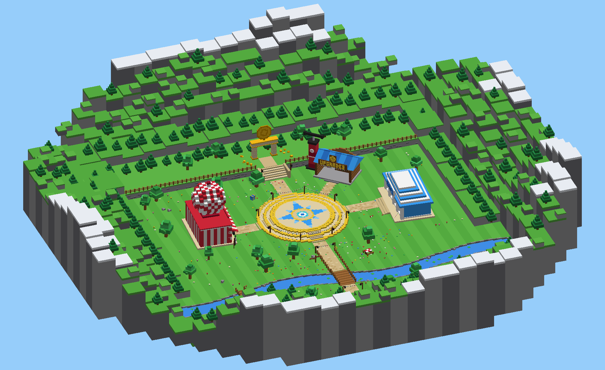

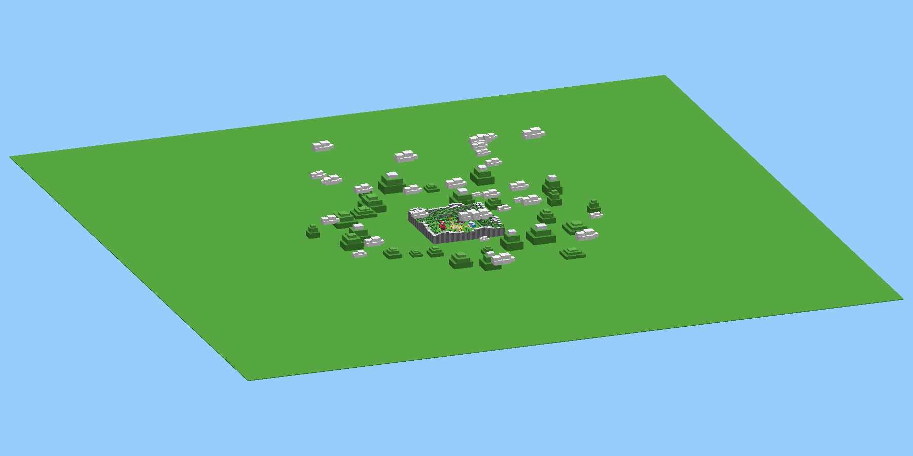

| | |
|---|---|
| 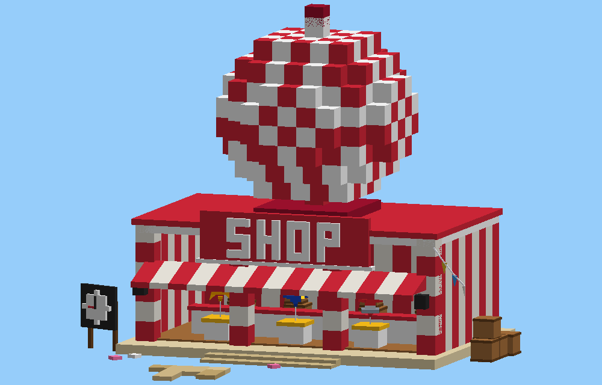 | 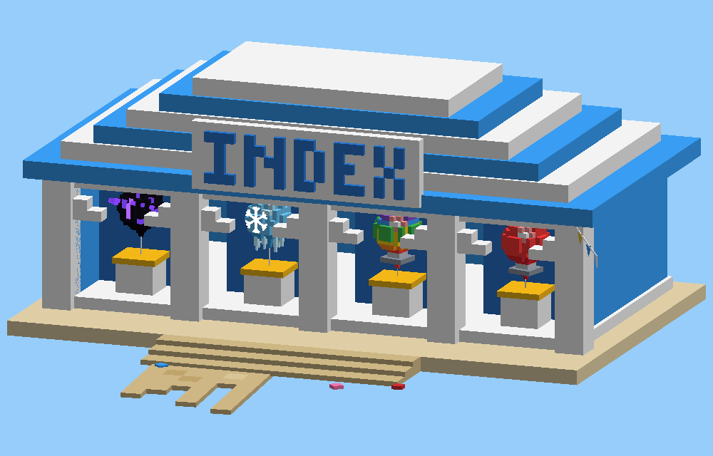 |
| 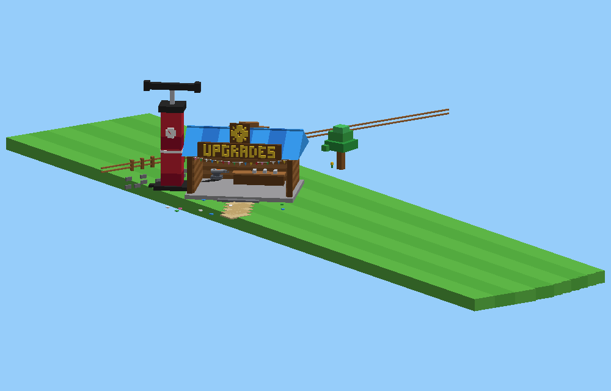 | 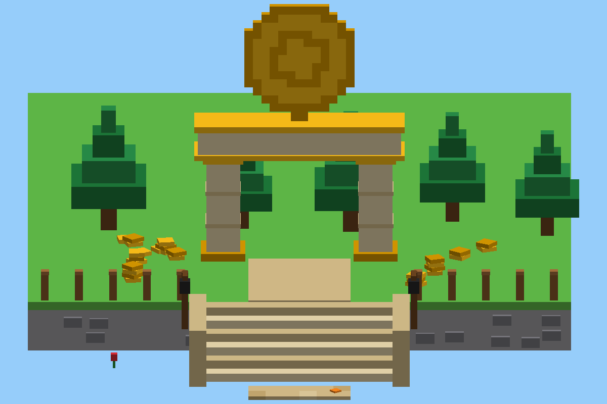 |

*Previews come from the generator's own renderer, not Studio.*

## What's on it

- **Launch plaza** (centre, the origin): three stepped tiers with yellow rims, a blue sun-star mosaic, a cyan target where the **SpawnLocation** sits, stairs on all four sides, and eight lamp posts strung with bunting.
- **Shop** (west): red-and-white striped building under a giant checkered gumball dome. It has a block-letter SHOP sign, a striped awning, three display pedestals (Gumball, Volt, Sun), a restock clock board, crates and lanterns.
- **Index hall** (east): blue hall with a stepped blue-and-white roof, an INDEX sign, and four arched display bays (Gumball, a rainbow Gumball, Frost, Void).
- **Upgrades workshop** (north-east): plank walls, a blue gable roof, an UPGRADES sign with a gear, a workbench with tools and an anvil, and the giant red balloon pump with its gauge and hose.
- **Golden coin arch** (north, decoration for now): a raised terrace with a grand staircase, stone cliff face, fences and coin piles. The arch has lanterns and a giant gold coin on top.
- **River** (south): studded water with stone banks, lily pads and rocks, a wooden bridge on the main path and a small bridge to the west.
- **Scenery:** blocky trees, pines on the back and side hills, flowers, confetti studs on the grass, a picnic table, a signpost and a treasure chest.
- **Border** (added after the first Studio test): a ring of stepped stud mountains with snowy peaks and pines around the whole map, grassland out to the horizon (4,096 studs across), distant stepped hills and stud clouds. You never see the void, from the ground or high in the sky.
- **Building sizes** (after the first Studio test): Shop ×1.5, Index ×1.45, Upgrades ×1.35, each moved out a little from the plaza.
- **GalleryAnchor** (south-east field): an invisible part where the demo balloon gallery lays out its two rows.

## Install

1. In your place, **delete the default `Baseplate` and `SpawnLocation`**. The map has its own ground (top at y = 0, matching `HazardConfig.GroundY`) and its own spawn, and the river trench would fill with baseplate otherwise.
2. Drag `build/StartMap.rbxmx` into Studio (or Model tab → Model → Insert from file). It lands as a `StartMap` Model with one sub-model per area (Plaza, Shop, Index, Upgrades, Arch, River, Trees, ...).
3. Everything is anchored plain Parts, so you can move, recolour or delete anything by hand afterwards.

To regenerate after changing the generator: `python3 tools/map/build_start_map.py --preview` (the previews need numpy + pillow).

## Next

Sky islands for Meadow Sky and Cloud Shelf, in the style of `reference/sky-islands.webp`. The two floating islands in the festival picture are where they'll hang.

## Invisible walls

Four invisible `InvisibleWall` parts (group `Boundary`, 120 studs tall) stand at the foot of the mountains, so players can't walk out of the map. Flight limits come later with FlightService.

## Sky islands (Meadow Sky + Cloud Shelf)

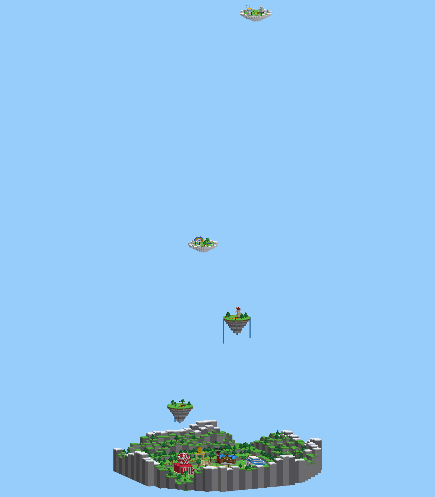

| | |
|---|---|
| 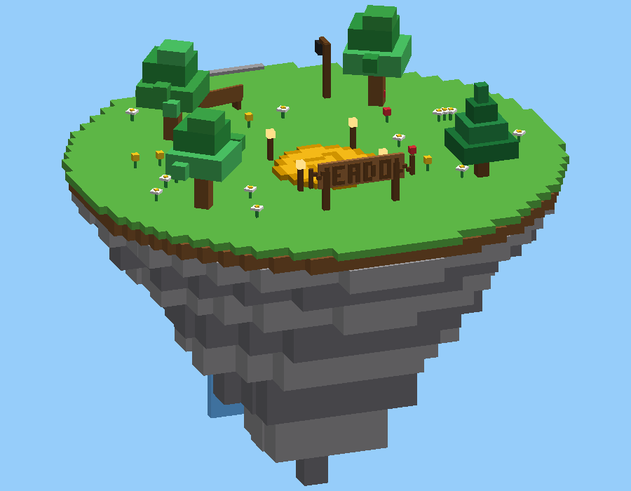 | 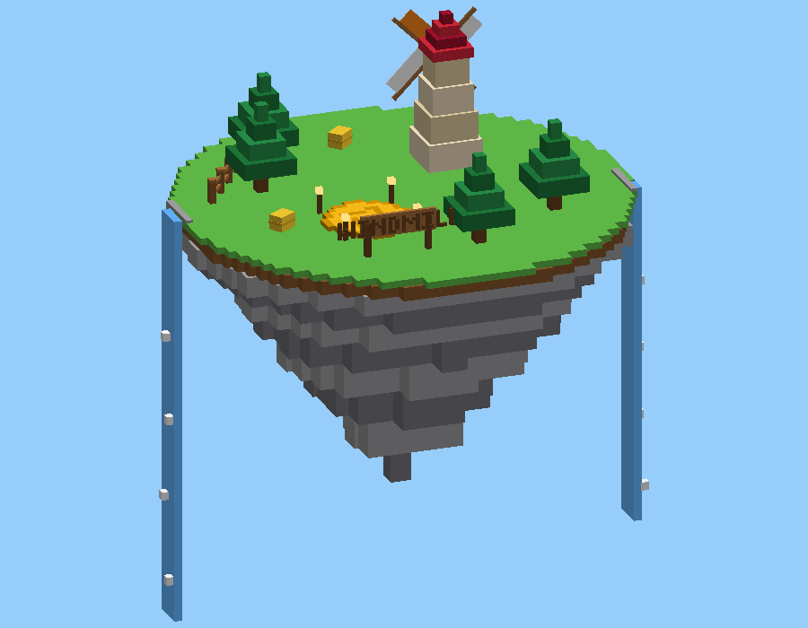 |
| 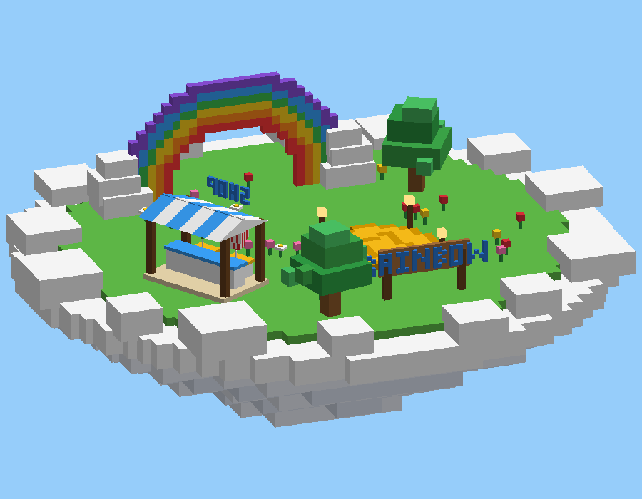 | 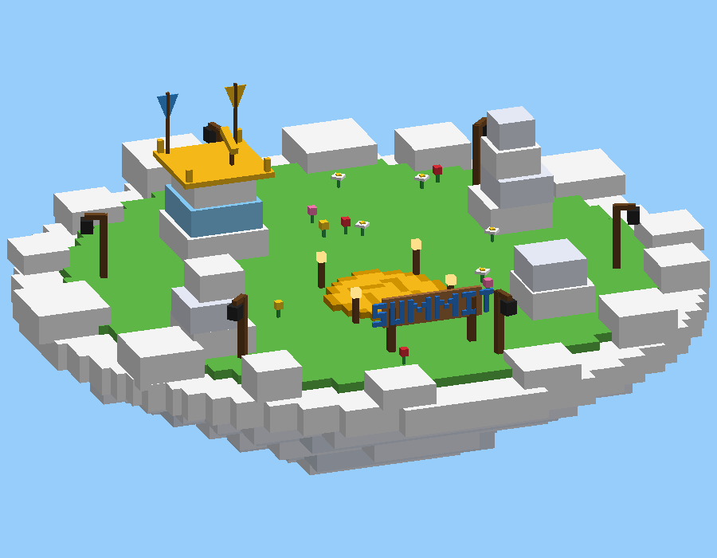 |

`build/SkyIslands.rbxmx` (about 1,500 parts), generated by `tools/map/build_sky_islands.py`, which also writes `src/shared/Config/IslandConfig.lua` for FlightService.

| Island | Zone | Height | Where | What's on it |
|---|---|---|---|---|
| Meadow Rest | Meadow Sky | 150 | north-west | trees, flowers, bench, lamp, waterfall |
| Windmill Hill | Meadow Sky | 350 | north-east | windmill, pines, hay bales, two waterfalls |
| Rainbow Shelf | Cloud Shelf | 560 | south-west | cloud island, rainbow arch, balloon stall (Spike, Popcorn) |
| Summit Cloud | Cloud Shelf | 1,100 | south-east | lookout tower with telescope and banners, cloud towers, gold lanterns |

**Placement rules:**
- None of the islands sits above the launch plaza, so a straight rise never hits one.
- There's one per map corner, about 90 studs out, so each is a straight rise plus a short steer.
- No two islands overlap from above, so a lower island never blocks the climb to a higher one.
- Heights follow reach. The starter Gumball tops out around 630 studs, so it reaches Rainbow Shelf (the spec's Phase 1 goal of reaching Cloud Shelf). Summit Cloud needs a Spike or Popcorn.

Every island has a gold coin landing pad with lanterns, plus an invisible `LandingPad` part.

## Sky look

`src/server/Services/WorldLook.lua` (started by `WorldBootstrap.server.lua`, and by the pack's Start script) sets up the festival sky:
- a warm early-afternoon sun
- a soft blue Atmosphere haze that hides the horizon edge
- gentle bloom so Neon glows
- sun rays and a slight colour boost
- dynamic Terrain clouds

For the best look, set Lighting → Technology to **Future** in Studio (a script can't change it).
