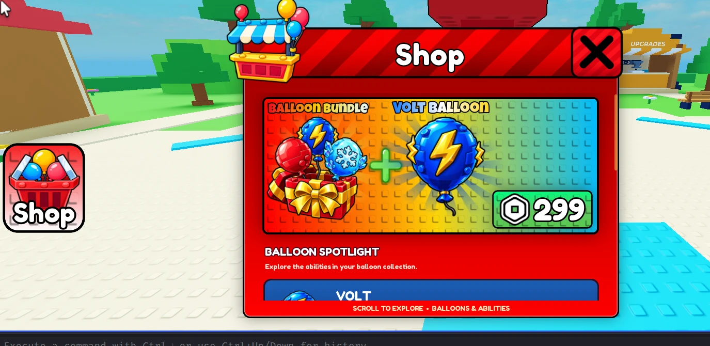

# UI style (keep for every menu from now on)

Gustav's reference: the Shop from the test game (`reference/shop-gui.webp`). The Index, inventory, upgrades, landing card and every later menu should match it.

- **Frame:** a bright red panel with a thick dark outline and rounded corners. The header bar has diagonal lighter-red stripes, and the title is centred in big white rounded type (Fredoka One / Lilita One style) with a dark stroke.
- **Close button:** a square red button with a big white **X**, a dark outline, overlapping the header's top-right corner.
- **Header art:** a 3D icon (here, a balloon stall) breaking out of the top-left of the frame.
- **Side buttons:** rounded-square HUD buttons on the left edge of the screen: a light gradient face, a big glossy icon, and the label below in white with a dark stroke ("Shop").
- **Content cards:** a rounded inner card with a dark outline. Promo banners use rainbow gradients over a subtle stud-grid pattern, with bold two-colour outlined titles ("BALLOON BUNDLE", "VOLT BALLOON").
- **Price pill:** green, rounded, with a dark outline, a white Robux icon and big white numbers.
- **Section headings:** uppercase bold white with a dark stroke ("BALLOON SPOTLIGHT"), and a smaller subtitle line under them.
- **List items:** tall rounded cards in the item's theme colour (blue for Volt), with the balloon art on the left and its name in bold white.
- **Scrolling:** vertical ScrollingFrame with a chunky orange scrollbar on the right, and a footer strip hint ("SCROLL TO EXPLORE • BALLOONS & ABILITIES").

Other references in `reference/`: `start-map-festival.webp` (the grass start map), `sky-islands.webp` (a style for each zone island), and `floating-plot.webp` (owned islands, Phase 3).
