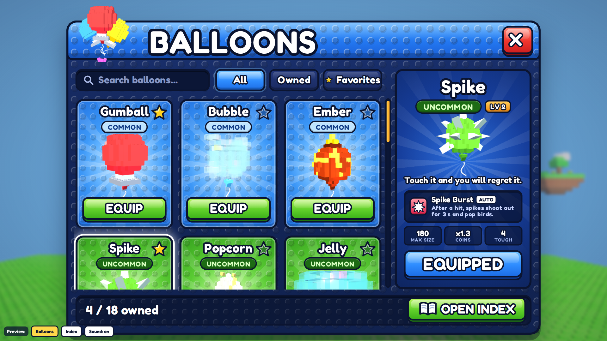
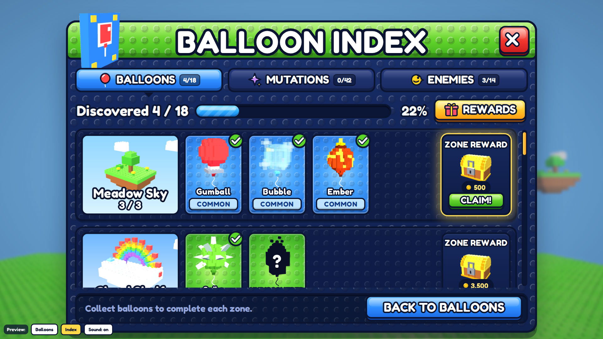

# New BALLOONS window + INDEX (Balloons / Mutations / Enemies)

Gustav's own design (two pictures, 2026-10-09), built as a real-size mock-up. Open `index.html` in a browser. It uses the game's real balloon models, ports of the real hazard models, and sounds that stand in for SoundConfig.

Gustav's answers (2026-10-10):
1. The cards use real 3D models in ViewportFrames, not painted pictures.
2. Each zone row shows the zone's real balloons (1 to 3 per row, not 4).
3. Zone chests give coins.
4. There is one Index with three tabs: Balloons, Mutations and Enemies.
5. The look is built from his pictures as this mock-up (not in Figma).
6. Build order: flight feel first, then this UI, then the stud settings menu.

## What it replaces

- **Replaced:** the current inventory window ("My Balloons") and the current Index window (Balloons / Mutations tabs, built 2026-10-05).
  - Keep the old ones in `ServerStorage.OldShopImports` (suffix `_BeforeIndexV3`).
  - The HUD's left SHOP / INDEX buttons and the Index stall's prompt now open these windows. INDEX opens the Index; the inventory button or stall opens BALLOONS.
- **Unchanged:** the Shop window stays as it is.
  - Its cards should switch to the new rarity colours below, so a balloon looks the same everywhere.

## Size and scaling (all numbers are design pixels)

- **Window size:** 1200 wide. The Balloons window is up to 840 tall and the Index up to 860, and both shrink to fit the screen.
- **UIScale:** `s = min(vw*0.965/1200, vh*0.95/600, 1.25)`.
- **Compact mode:** used when `vh/s < 760` (phones held sideways, small laptops).
  - Header 80 tall (title 60).
  - Toolbar 50, footer 64, cards 290 tall.
  - The detail panel hides its stats row.
- **Content scrolls:** the cards and rows sit in a ScrollingFrame with a chunky orange scrollbar thumb (UI_STYLE).
- **Checked sizes:** 1920x1080, 1366x768 (compact) and 844x390 phone (compact). See `pictures/phone-*.png`.

## Look (tokens)

- **Outline (ink):** `#0B1430`, 4–5 px on everything. Body panel: gradient `#1C3474 → #11224F`, stud texture `rbxassetid://6927295847` at 55% (tile 30).
- **Inset wells** (search, footer): `#0C1838`, with a dark inner shadow.
- **Headers** (stud texture, white shine on the top 46%, darker 12 px base):
  - BALLOONS is blue `#45A6FF → #2377F0 → #1A5FD6`.
  - INDEX is green `#9CF04A → #5FD12A → #3FAE1C`.
- **Title:** Fredoka One 76 (60 in compact), white, ink stroke 13, drop shadow 6 px.
  - On the Index it changes per tab: BALLOON INDEX / MUTATION INDEX / ENEMY INDEX.
- **Close:** a red chunky button 78×78 with a white X with an ink outline.
- **Chunky buttons:** a face gradient, a darker lip 7 px under it, a gloss on the top 42%, and the label in Fredoka with an ink stroke 7. They press down 4 px.
  - green `#B6F55A → #62D12B → #3DB21A` / lip `#1F7410`
  - blue `#6CC0FF → #2E8CFF → #1D6EE6` / lip `#0F46A8`
  - grey `#C9CDD8 → #9AA1B2 → #7C8396` / lip `#474D60`
  - gold `#FFF07A → #FFC52A → #FF9D14` / lip `#A4510A`
  - red `#FF8A7A → #F0352D → #CF1F1F` / lip `#7E0D10`

**Rarity themes:** the card is a radial gradient (centre, mid, edge), with sunburst rays spinning once per 40 s and the stud texture at 70%. These replace `BalloonConfig.TierColors`, and the Shop cards should use them too.

| Tier | Centre | Mid | Edge | Pill bg / text |
|---|---|---|---|---|
| Common | `#8FD0FF` | `#47A6FF` | `#1F6FE0` | `#BFE4FF` / `#123C86` |
| Uncommon | `#C2FF74` | `#66D83A` | `#2E9A1A` | `#1D6B14` / `#D9FFC0` |
| Rare | `#A6F6FF` | `#33D2F0` | `#0F8FC4` | `#0B5E86` / `#E2FBFF` |
| Epic | `#E2B2FF` | `#B25CFF` | `#6E24D6` | `#4A1596` / `#F1E0FF` |
| Legendary | `#FFE58A` | `#FFB028` | `#F06D10` | `#7A3606` / `#FFE9C0` |
| Mythic | `#FFC2EF` | `#FF4FC8` | `#C81E96` | `#6E0D58` / `#FFE0F6` |
| Secret | `#5C5F78` | `#30334A` | `#16182A` | `#16182A` / `#FFD84A` (gold rays) |

## BALLOONS window

**Header:** the title BALLOONS. The 3D icon (three Gumball models recoloured red, blue and yellow, tied with a pink bow) breaks out of the top-left of the frame. It sways gently.

**Toolbar:**
- A search box ("Search balloons...") that filters by name or rarity as you type.
- Tabs **All / Owned / ★ Favorites**. The active tab is blue.

**Grid:** 3 columns, cards 242×330, gap 16. Owned balloons come first, then all others in `Order`.

**Card:**
- **Top:** the name (Fredoka 30, stroke 8), with the rarity pill under it.
- **Star:** top-right. Yellow when it's a favourite, a dark outline when not. It pops when tapped.
- **Middle:** a ViewportFrame with the real BalloonModels balloon and a short curly string.
  - It spins 0.6 rad/s and bobs. On hover it spins about 4x faster and hops.
- **Bottom button:**
  - **EQUIPPED** (blue) on the held balloon.
  - **EQUIP** (green) on other owned balloons.
  - **LOCKED** (grey, with a lock) on balloons you don't own.
- **Tapping a LOCKED button:** the card shakes, the Error sound plays, and a red toast says "Buy Jelly in the Kite Fields shop!".
- **Secret Cluck (not owned):** a black silhouette with a white "?", the name "???", the SECRET pill, and gold rays.
- **Selected card:** a white outline glow.

**Detail panel** (right side, 346 wide), for the selected card. It starts on the equipped balloon.
- **Header:** the name (44), then the rarity pill and an **LV n** chip if owned.
- **Model:** a big turning model.
- **Flavour line:** one short line per balloon (the list is in `index.html`, `B[...].flav`).
- **Ability box:** the existing ability icon, the ability name, a key tag (AUTO / Q / SPACE) and the one-line text from AbilityConfig.
- **Stats row:** MAX SIZE, COINS x, TOUGH.
- **Big button:** EQUIPPED, EQUIP, LOCKED or SECRET.
- **Not owned:** a gold chip under the model says "Buy it in the Kite Fields shop" (Cluck says "Only in a Balloon Rain").

**Footer:** "4 / 18 owned" on the left, and a green **OPEN INDEX** button with a book icon on the right, which swaps to the Index.

**Equip:** stars burst out of the card, the Equip sound plays, and all buttons update.

## INDEX window

**Header:** green. A 3D book icon (blue stud cover, balloon emblem, gold corners) breaks out of the top-left.

**Tabs** (a full-width row of 3, each with an icon and a count chip like "4/18"):
- **BALLOONS:** blue when active.
- **MUTATIONS:** purple when active.
- **ENEMIES:** orange when active.
- A small ink arrow under the active tab points down.

**Progress row:**
- "Discovered 4 / 18".
- A progress bar with a striped animated fill that grows on tab switch.
- The % number.
- A gold **🎁 REWARDS** button.

**Rows:** each row is 236 tall:
- **Zone picture (250×206):** a 3D diorama with the zone name, a count like "3 / 3", and a SOON chip for zones not in the game yet.
- **Cards (150×206):**
  - **Found:** the model, the name, the pill and a green check badge.
  - **Not found:** a black silhouette of the real model, a white "?", "UNDISCOVERED" and the pill.
  - Tapping a card opens an info bubble.
- **ZONE REWARD chest (176 wide), pinned to the right end:**
  - **Locked:** a grey LOCKED button, a padlock on the chest, and a coin chip with the amount.
  - **Ready** (row complete): a gold pulsing glow, the chest hops, the padlock shackle bobs, and a green **CLAIM!** button.
  - **Claim:** the lid swings open, coins burst out, the sound plays (Bank, then Fanfare), and "+500 coins!" pops above the chest.
  - **After:** the button reads **CLAIMED**, and the chest stays open with coins.

**Footer:** a hint per tab and a blue **BACK TO BALLOONS** button.

### Balloons tab: one row per zone (from `BalloonConfig.Sold`)

| Row | Balloons | Chest |
|---|---|---|
| Meadow Sky (`Ground`) | Gumball, Bubble, Ember | 500 |
| Cloud Shelf | Spike, Popcorn | 3,500 |
| Kite Fields | Jelly, Buzz | 30K |
| Windways | Frost | 75K |
| Thunderhead | Volt, Thorn | 1.5M |
| Hail Belt | Clock, Flame | 14M |
| Stratosphere | Whale, Iron | 50M |
| Orbit (`Moon Hub`) | Void, Sun | 600M |
| Sky Boss | Crown | 500M |
| Secret (`Balloon Rain`) | Cluck | 1B |

Chests pay about half of what the zone's balloons cost together (a first guess, easy to tune). A balloon counts as **found** once you have owned it (`index.balloons`). Popped balloons stay owned, so it never goes back.

**Info bubble:**
- **Found:** the ability and the level.
- **Not found:** "Sold in the Kite Fields shop. Buy it once to add it to your Index."

### Enemies tab: one row per zone

| Row | Enemies (danger) | Chest |
|---|---|---|
| Meadow Sky | Sparrow (EASY), Plane (EASY) | 300 |
| Cloud Shelf | Pinwheel (MEDIUM), Nimbo (MEDIUM) | 2,000 |
| Kite Fields | Kite (MEDIUM), Gulls (HARD) | 20K |
| Windways | Gust (MEDIUM) | 50K |
| Thunderhead | Zap (HARD), Eagle (HARD) | 1M |
| Hail Belt | Hail (MEDIUM) | 8M |
| Stratosphere | Satellite (HARD), Meteor (EXTREME) | 40M |
| Orbit | Vacuum (EXTREME) | 300M |
| Sky Boss | Pin King (BOSS) | 500M |

**Enemies in the game today** (Sparrow, Plane, Pinwheel, Nimbo):
- The card shows the real hazard rig (`Hazards/Visuals/<Name>.Build` and `.Animate`) in a ViewportFrame. The Sparrow flaps, the Pinwheel spins and Nimbo bobs.
- The card colour is the hazard's own `Color` / `Hot` / `Deep`.

**Future enemies:** silhouettes only, from `IndexModels.rbxmx` (`Enemy_*`). Their names are placeholders from the game prompt.

**Danger pill colours:**

| Danger | Pill bg / text |
|---|---|
| EASY | `#1D6B14` / `#D9FFC0` |
| MEDIUM | `#8A5A00` / `#FFF0B8` |
| HARD | `#8A1F0B` / `#FFD9CC` |
| EXTREME | `#4A1596` / `#F1E0FF` |
| BOSS | `#16182A` / `#FFD84A`, with a skull |

**Found** means you met it: the first time a hazard of that type starts an attack on you (the server already sends Begin).

**Each found card** shows **"DODGED n"**: the count of its attacks that reached HitTime without hitting you. This uses the same check as the dodge streak in the flight-feel spec.

**Info bubble:** the zone, the attack name and a tip:
- **Sparrow** (Corkscrew Dive): "It locks on, then dives. Steer sideways or dash the moment it tucks its wings."
- **Plane** (Crease Cutter): "It cuts in a straight line. Rise or drop out of the line before it folds into a dart."
- **Pinwheel** (Saw Bloom): "Its 4 blades fly out around you and snap shut in a cross. Get out of the square fast."
- **Nimbo** (Pin Drizzle): "It rains pins straight down. Never float right under it."

### Mutations tab: one row per balloon

- **A purple banner:** "MUTATIONS ARE COMING. They roll on your balloon while you fly. Land to keep them, pop and they are gone!"
- **Then two "Any balloon" rows** (the universal 8: Chrome, Shadow, Stripes, Neon / Sparkle, Steel, Gold, Rainbow), then one row per balloon with its own mutations (prompt section 5.4). That makes 42 in total.
- **Row picture:** the balloon (a silhouette if you don't own it).
- **Cards:** for now every card is a "?" silhouette of that balloon with the mutation's rarity pill.
- **Chest:** a ROW REWARD chest per row.
- **Later:** when M4 (Mutations) is built, a found card shows the balloon wearing that mutation.

### Rewards popup (REWARDS button)

Gold header. Four milestones per tab:

| Milestone | Reward |
|---|---|
| 25% | +1K coins |
| 50% | +25K coins |
| 75% | +250K coins |
| 100% | +2.5M coins and the title **COLLECTOR** |

Each milestone row shows "Find 5 of 18 (4/5)" and a CLAIM or LOCKED button.

## Data and remotes (server-authoritative)

**Save additions** (DataService defaults):
- `favorites = {}` (balloonType → true).
- `index.enemies = {}` (id → { met = true, dodged = n }).
- `index.claimed = {}` (`"B:Meadow Sky"`, `"E:Cloud Shelf"`, `"M:Spike"`, `"MS:Balloons:25"` → true).
- `index.balloons` already exists.

**New remotes:**
- `ToggleFavorite(type)`.
- `ClaimIndexRow(kind, rowId)`: the server checks the row is complete and not claimed, then pays.
- `ClaimIndexMilestone(tab, pct)`.
- Equip uses the existing remote.

**New config:**
- `IndexConfig`: zone rows, chest amounts, milestones, enemy list (zone, danger, colours, attack, tip) and flavour lines.
- Everything numeric lives there.

**Sounds** (all existing SoundConfig ids, no new uploads):

| Action | Sound |
|---|---|
| Open / close window | Open / Close |
| Tabs, cards, favourite | Click |
| Equip | Equip |
| Locked | Error |
| Chest claim | Bank + Fanfare, CoinIn per coin |

## Models for Studio

`IndexModels.rbxmx` holds display models for ViewportFrames only. They never go in the world.

| Model | Notes |
|---|---|
| `Zone_MeadowSky` … `Zone_Secret` | 10 zone dioramas for the row pictures. |
| `Enemy_Kite` … `Enemy_PinKing` | 10 silhouettes of future enemies. |
| `Chest` | Parts plus sub-models `Lid` (with an invisible `Hinge` part at the back edge: rotate the lid about Hinge X by up to 1.35 rad to open), `Lock` (hide when claimed) and `Coins` (show when opening or claimed). |
| `IndexBook` | The Index header icon. |

**Silhouettes:** clone the model, set every part's Color to `#0A0F26`, set Material to SmoothPlastic, and set the ViewportFrame `Ambient` to the same colour with LightColor black.

**Camera:** each card uses a camera fitted to the model's bounding box, about 12° above, turning slowly.

## Templates

Following the HUD/Menu pattern: editable `BalloonsTemplate` and `IndexTemplate` in StarterGui (`Install()`), and the code finds everything by name:

- `Header.Title`, `Header.Close`, `Header.Icon`
- `Toolbar.Search`, `Toolbar.Tabs.All|Owned|Favorites`
- `Grid.CardTemplate` (`Name`, `Rarity`, `Star`, `View`, `Button`)
- `Detail` (`Name`, `Rarity`, `Level`, `View`, `Flavour`, `Ability`, `Stats`, `Where`, `Button`)
- `Footer.Owned`, `Footer.OpenIndex`
- `Tabs.Balloons|Mutations|Enemies`, `Progress.Text|Bar|Percent|Rewards`
- `Rows.RowTemplate` (`Zone`, `Cards`, `Chest`)
- `Popups.Info`, `Popups.Rewards`

Gustav can restyle all of it in Studio.
