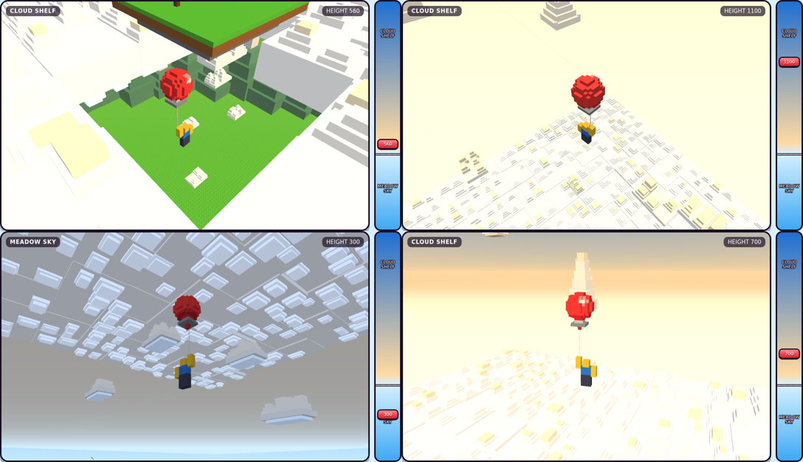

# Zone layers: Meadow Sky, the cloud deck and Cloud Shelf

The sky changes with your height. Meadow Sky (0–500) is bright blue with puffy stud clouds, petals and pollen.
From 400 a stud cloud deck closes in above you like a ceiling. At 500 you burst through it (cloud puff ring,
flash, whoosh). Above it, in Cloud Shelf (500–1,500), the deck is a floor under you, the sky is deeper with a
golden haze and a bigger sun, small golden cloudlets float past, and tall cloud towers stand far away.

Preview (same numbers and the same cloud shapes as the game code): open `index.html`, or
https://claude.ai/artifact/VhWR3vJboCj4unMUBUoNbh

## Files

| File | What it is |
|---|---|
| `ZoneLayerConfig.lua` | All the numbers: one entry per zone (sky, clouds, near bits), the deck, towers, blend, punch-through, studs. A new zone just adds an entry. Generated by `tools/zones.py`. |
| `ZoneLayerController.lua` | Client controller. Builds and moves everything locally, so every player sees the sky for their own height. |
| `CloudModels.rbxmx` | Sample stud clouds (4 puffy clouds, 4 cloudlets, a 4x4 deck patch, a tower) to look at or reuse in ServerStorage. The game does not need it: the controller builds the clouds itself. |
| `index.html` + `lib/` | The 3D preview with the height slider. |
| `tools/` | `zones.py` (writes the config + `zones.json`), `clouds.py` (writes `CloudModels.rbxmx` and checks for overlapping parts), `build.py` (builds the preview from `src.html`). Run them inside `tools/`. |

## Hooking it up in Studio

The Studio place is newer than the repo (it has the feel-pass sky by height, the weather and the zone banner),
so this has to be joined to what is in Studio:

1. Put `ZoneLayerConfig` next to the other configs (`…Shared.Config`) and `ZoneLayerController` next to
   `FlightController` in the client Controllers.
2. Start it in `ClientMain` after `SoundController`:
   `require(script.Parent.ZoneLayerController).Start({ Shared = opts.Shared, Sound = Sound })`
3. **Turn off the old sky-by-height code** from the feel pass. Both would write Lighting and Atmosphere every frame.
4. **Zone banner:** keep the existing banner and fanfare, but trigger it from
   `ZoneLayerController.ZoneChanged.Event:Connect(function(zone, oldZone) … end)` (`zone.Name` is
   "CLOUD SHELF"). Make sure only one banner shows. `ZoneLayerController.PunchThrough` (up: boolean) fires when
   you cross the deck.
5. **Weather goes on top** with `ZoneLayerController.SetOverlay(id, values, weight, fadeTime)` instead of
   writing Lighting directly. `values` uses the same keys as `Sky` in the config. `SetOverlay(id, nil)` fades it
   out. Colours are `Color3.fromHex(...)`. Starting values (tune in Studio):

   | Weather | Overlay values |
   |---|---|
   | Sunny / Clear | none (`SetOverlay("Weather", nil)`) |
   | Breeze | none for the look (the wind push stays in the weather code) |
   | Rain | `AtmosDensity = 0.42, AtmosColor = C0CCDA, Brightness = 2.2, Saturation = 0.02, CloudCover = 0.85` |
   | Rainbow | `Saturation = 0.34, Brightness = 3.3` |
   | Fog | `AtmosDensity = 0.55, AtmosHaze = 3, AtmosColor = E8E4DC` |
   | Golden Hour | `ClockTime = 17.4, Tint = FFE0B0, AtmosColor = FFC98A, Brightness = 3.2` |

6. **Islands:** `ZoneLayerConfig.Islands.Folders` lists the workspace folders with the island models (now
   `SkyIslands`). Clouds keep away from them, and an island within 80 studs of 500 gets a hole in the deck around
   it. If the folder is missing it falls back to `IslandConfig`.
7. The controller writes `Lighting` Brightness, ClockTime, ExposureCompensation, Ambient and OutdoorAmbient; the
   `Atmosphere`; a `ZoneLayerCC` and a `ZoneLayerFlash` ColorCorrection; `Sky.SunAngularSize`; and the Terrain
   `Clouds`. It does not change the Sky pictures. All its parts are in `workspace.ZoneLayers`.
8. Don't press Play: Gustav tests. Save with Ctrl+S.

## What Gustav should test

- Fly up from spawn: blue sky and puffy clouds, petals and pollen near you.
- From about 400: the cloud ceiling closes in above you.
- At 500: puff ring, flash, whoosh, CLOUD SHELF banner. Inside the deck the mist goes white for a moment.
- Above: the clouds are a floor, golden haze, cloud towers far away, mist wisps and golden dust.
- Fall back down after a pop: the look goes back to Meadow Sky and the ceiling is above you again.
- Weather still shows on top (rain, fog, golden hour).

## Notes

- All cloud parts: Anchored, CanCollide/CanQuery/CanTouch off (you and the camera go straight through),
  CastShadow off (a deck at 500 would shadow the whole map). Tops use Gustav's stud picture
  (`rbxassetid://6927295847`); `Studs.On = false` turns it off.
- No part overlaps another: puffs sit on a grid on their slab and stack touching. `tools/clouds.py` checks a
  full 18x18-tile deck (3,702 parts): 0 overlaps. Drifting clouds keep 4 studs apart and fade out before they
  would touch an island.
- About 2,500 deck parts are near you while you are within 800 studs of the deck. If phones lag: lower
  `Deck.Radius` (320), the cloud `Count`s, or set `Studs.On = false`.
- Checked here: both Luau files compile; the controller ran in a Luau VM with a mock Roblox for a full flight
  0 → 1,300 → 0 (zone changes both ways, punch-through up and down, weather overlay in and out, no errors);
  the cloud shapes are identical in the preview, `clouds.py` and the Luau code.
- Not checked here (needs Studio): the real Roblox look of the Atmosphere values, the stud texture on clouds,
  and the frame rate.
